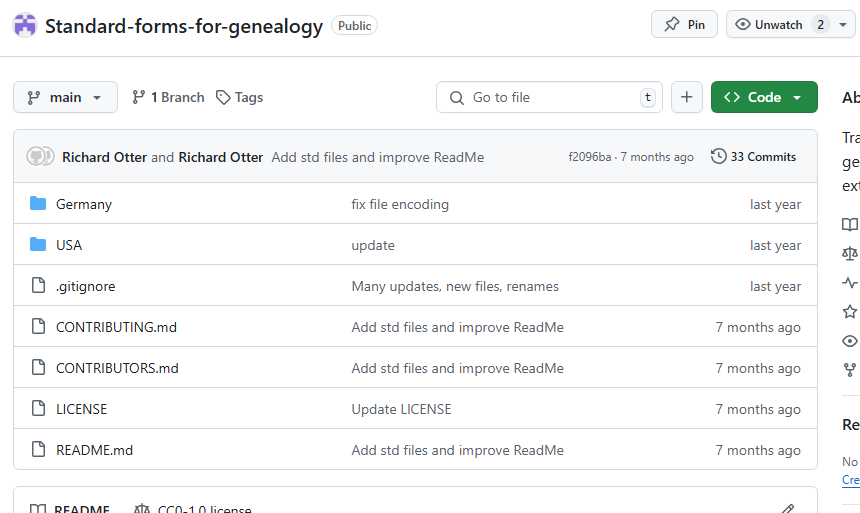
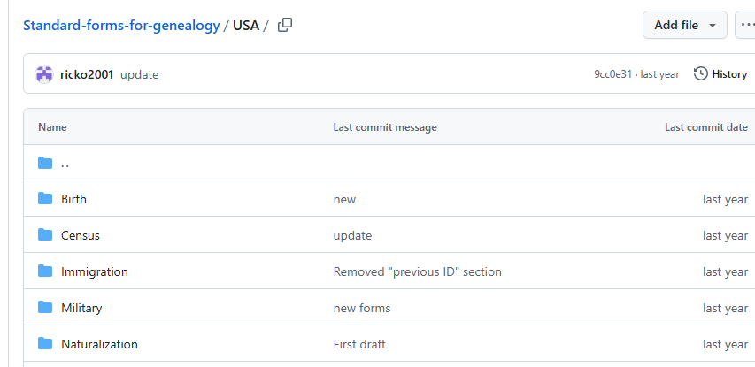
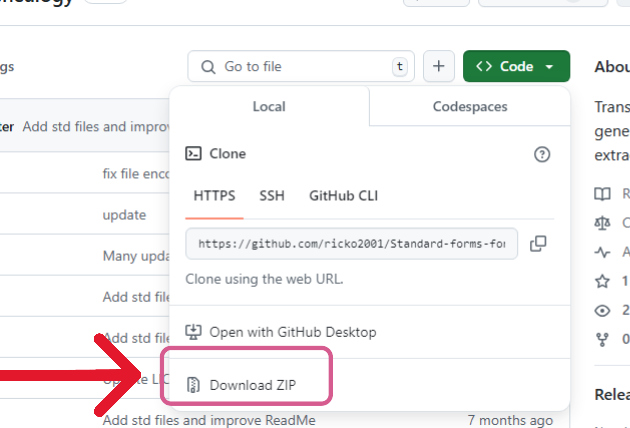

[Home](https://richardotter.github.io)

# Instructions for downloading files from GitHub without using git

GitHub provides download ability for single files or entire repositories.

## Single File
This is not as obvious as you may hope, but is easy once you know how.

Opening a link to GitHub may show a folder of files or an individual file:

### A link to a GitHub folder will bring you to a page looking like this

Click the file name that you wish to download.\
The file will be displayed in a line-numbered format.
Now click on the download button near the top right side of the window.

A copy of the "raw" file, the file without line numbers (as it is actually stored on the server)
will be downloaded to your specified location.

### A link to a GitHub file (FILE_LINK) will directly display the line-numbered format file

 

Again, click the download button near the top right corner to bring it to your computer.

## Multiple files

Files in GitHub are always contained in named "repositories" (repo), which appears like a folder. 
Repos may also contain sub folders. To download multiple files- there are only two choices, download 
each file separately using the instructions above, or download the entire repo.

A repo will look something like this:

If one of the folders contained in the repo is opened, the page will look like:

Note that te repo display has a distinctive line of buttons and controls. Including the 
button labeled "<> CODE".

To download all of the files in the repo, including its sub folders, click the "<> Code" button
and select the Download zip

You will then be asked to choose the destination.

