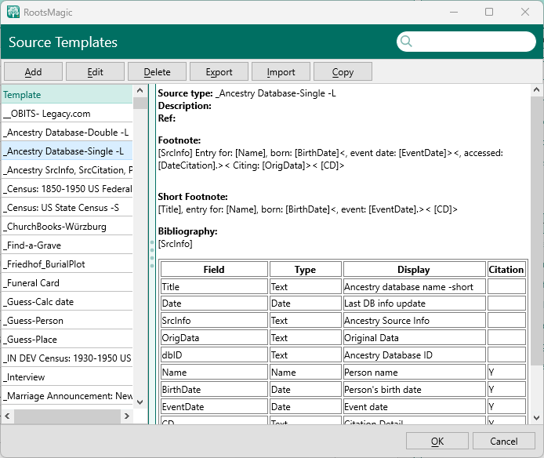
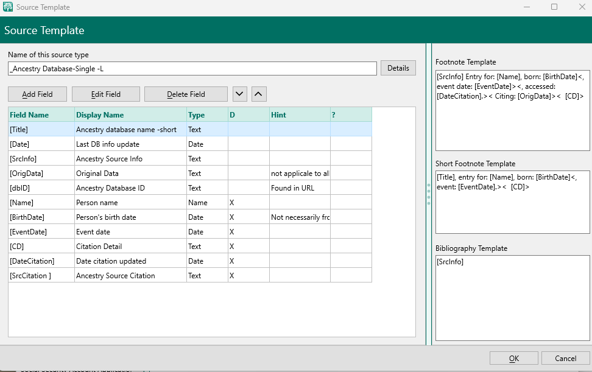
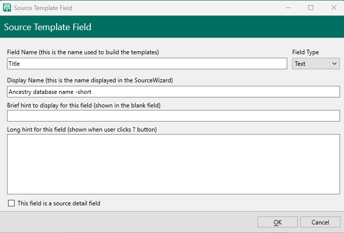

[Home](https://richardotter.github.io)

# Source Template Design

Configuration items that go into defining a source template are visible in three different windows. In some cases the same items are displayed with different names. Part of the problem is that nomenclature for sources and citations seems to have changed over the years but these dialogs have not been updated.

This page will show the three windows, the various fields in those windows and the corresponding XML elements found in the rmst file.

## First window

In the RM Sources Tab, select the "Source Template List" command in the three dot menu. The window titled RootsMagic with the header: "Source Templates" is displayed.

Window title= RootsMagic\
Header= Source Templates

### Window contents
| Organization |  |
|--|--|
|Header |Row of command buttons; Search box|
|Left panel| List of existing source templates|
|Right panel|  Details of the source template selected in the left panel list}

Details panel shows the following information:\

| Label          | description                                                   | XML element                 |
| -------------- | ------------------------------------------------------------- | --------------------------- |
| Source type    | Name of the source template                                   | \<Template>\<Name>          |
| Description    | Text describing the template                                  | \<Template>\<Description>   |
| Ref            | User entered keyword used to group similar types of templates | \<Template>\<Category>      |
| Footnote       | Sentence in the RM source language                            | \<Template>\<Footnote>      |
| Short Footnote | Sentence in the RM source language                            | \<Template>\<ShortFootnote> |
| Bibliography   | Sentence in the RM source language                            | \<Template>\<Bibliography>  |

Below this, is a table with four columns:

- Field
- Type
- Display
-Citation

A separate row is displayed for each field in the template.

The columns correspond to the following .mst XML elements.

| Column   | Contents                                                                                                                                     | XML element                                                        |
| -------- | -------------------------------------------------------------------------------------------------------------------------------------------- | ------------------------------------------------------------------ |
| Field    | The data item name used by RM sentence language.                                                                                             | \<Template>\<Field>\<Name>                                         |
| Type     | One of: Text, Name, Place, Date                                                                                                              | \<Template>\<Field>\<Type>                                         |
| Display  | The field name displayed when entering the source or citation. This can contain more descriptive text than the actual field name             | \<Template>\<Field>\<Display>                                      |
| Citation | Either blank or "Y". Blank means the field is associated with the Source (master source), Y means the field is associated with the citation. | \<Template>\<Field>\<Detail>   (value is either "false" or "true") |

## Second window

When one selects a template and clicks the "Edit" button, a second window, titled "Source Template", header: "Source Template", is displayed.

Window title= Source Template\
Header= Source Template

### Window contents

Organization\
This window is divided into left and right side panels.\

#### Left side panel

- Name of this source type:  Editable name, and a "Details" button that shows the Category and Description fields as in the previous window.
- Button row
- Table with 6 columns

| Window label | XML element                    |
| ------------ | ------------------------------ |
| Field Name   | \<Template>\<Field>\<Name>     |
| Display Name | \<Template>\<Field>\<Display>  |
| Type         | \<Template>\<Field>\<Type>     |
| D            | \<Template>\<Field>\<Detail>   |
| Hint         | \<Template>\<Field>\<Hint>     |
| ?            | \<Template>\<Field>\<LongHint> |

#### Right side panel

- Footnote Template
- Short Footnote Template
- Bibliography Template

**Note that the "Long Hint" is not displayed since ver 7**

**Note that in this window, the D column shows the same info as in the previous window's Citation column but in a different format.**\
**In the previous window Y was a citation field, in this window, it is shown as an "X".**

The right side of the windows has text fields to enter the template language data to create the Footnote, Short Footnote, and the Bibliography sentences.

## Third window

The Source Template Field window is displayed by selecting a field in the table in the previous window and clicking the Edit Field button:

Display the field edit window.

Window title: Source Template Field\
Header: Source Template Field

### Window contents

Organization\
One panel with multiple edit controls.

| Label        | Contents                                                                  | XML element                    |
| ------------ | ------------------------------------------------------------------------- | ------------------------------ |
| Field Name   | The name used in the template language to represent data.                 | \<Template>\<Field>\<Name>     |
| Field Type   | Types available: Text, Name, PLace, Date.                                 | \<Template>\<Field>\<Type>     |
| Display Name | The name displayed in the SourceWizard                                    | \<Template>\<Field>\<Display>  |
| Brief hint   | Help text shown in light grey in the blank field                          | \<Template>\<Field>\<Hint>     |
| Long hint    | Help text displayed in RM ver 7 and earlier when the ? button  is clicked | \<Template>\<Field>\<LongHint> |
| Checkbox:    | Checked means this field is a source detail field  (citation)             | \<Template>\<Field>\<Detail>   |

**Note that the checkbox in checked state indicates a source detail field  (citation)**
