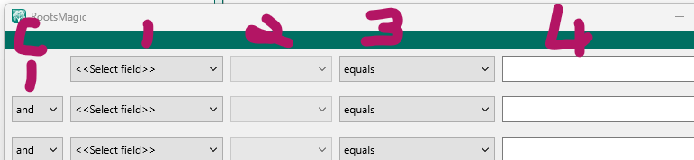

[Home](/index.html)

# Advanced Search Options

see- [RootsMagic Help: Advanced Search](https://help.rootsmagic.com/RM9/person-search--(advanced).html)

# FIELD 1
## Special Search Items
Field one selection menu contains an entry for-
each standard fact, each custom fact, and the non-specific fact search items listed here:

* Given name(s)
* Given or Nickname
* Surname
* Surname (Birth or Marr)
* Married surname
* Nickname
* Prefix
* Suffix
* 
* Sex
* Living flag
* Date edited
* Current age
* Record number
* 
* Any Fact
* 
* Color coding
* FamilySearch ID
* 
* Note (family)
* Note (general)
* 
* Number of children
* Number of sets of parents
* Number of siblings
* Number of spouses
* 
* Source (family)
* Source (general)

Unfortunately, these search items are mixed in with the large list of Fact names. Some users never find them.

===========================================DIV50==
NOTES:
Untested assumptions on how these work:

The name fields can appear in any of the names attached to the person.
"Alternate name" is FactTypeID 900, not in the menu and is never used.
"Association" is FactTypeID 902 is bot related to the Associates feature, but is a standard fact.

# FIELD 2
When field 1 is:
Standard or Custom Fact (single or family)
Any Fact

Field 2 is:
date
place
place details
value
note
source
age			untested. Presumably = current date - fact date
exists		a fact of this type is attached to the person

===========================================DIV50==
When field 1 is:
Name fields
Note (fam or gen)
Current age
Date edited
FamilySearch ID
Living flag
Number of ...
Sex
Source (family) (general)

Field 2 is:
no selections available, Field 3 displays options for Field 1 data type.

===========================================DIV50==
When field 1 is:
Color coding

Field 2 is:
Set 1:
...
Set 10:

# FIELD 3

Standard or Custom Fact (single & family)   date
Any Fact        date
Date edited     <blank>

equals
not equal to
is before
is after
is blank
is not blank
contains
does not contain

===========================================DIV50==
Standard or Custom Fact (single & family)   age

===========================================DIV50==
Name fields- all      <blank>
FamilySearch ID     <blank>
Standard or Custom Fact (single & family)   place
Standard or Custom Fact (single & family)   place details
Standard or Custom Fact (single & family)   value

equals
not equal to
contains
does not contain
less than
greater than
less than or equal
greater than or equal
sounds like
is blank
is not blank

===========================================DIV50==
Standard or Custom Fact (single & family)   note

contains
does not contain
is blank
is not blank

===========================================DIV50==
Standard or Custom Fact (single & family)   exists
Living flag    <blank>

is False
is True

===========================================DIV50==
Sex

is male
is female
is unknown
is not male
is not female
is not unknown

===========================================DIV50==
Source (family) (general)
Standard or Custom Fact (single & family)   source

exists
does not exist

footnote contains
footnote does not contain
footnote is blank
footnote is not blank

short footnote contains
short footnote does not contain
short footnote is blank
short footnote is not blank

bibliography contains
bibliography does not contain
bibliography is blank
bibliography is not blank

text contains
text does not contain
text is blank
text is not blank

comment contains
comment does not contain
comment is blank
comment is not blank

name contains
name does not contain

ref# contains
ref# does not contain
ref# is blank
ref# is not blank

detail ref# contains
detail ref# does not contain
detail ref# is blank
detail ref# is not blank

detail contains
detail does not contain
detail is blank
detail is not blank

research note contains
research note does not contain
research note is blank
research note is not blank

detail comment note contains
detail comment note does not contain
detail comment note is blank
detail comment note is not blank

===========================================DIV50==
Number of ...
Standard or Custom Fact (single & family)   age

equals
not equal to
less than
greater than
less than or equal
greater than or equal

===========================================DIV50==
Color coding     Set 1: to Set10:

is Black (off)
is Red
is Lime
...
is Slate
is not Black
is not Red
is not Lime
...
is not Slate

</body>
</html>

