# RootsMagic Tips and Tricks

[Home](https://richardotter.github.io)

This page updated: 2025-03-12

Applies to RootsMagic v10.0.5 software unless otherwise noted, published
by [RootsMagic, Inc.]("https://rootsmagic.com)

## Copy / Move Fact commands

New feature in v10 (TMG had it 20 years ago)

The Copy and Move commands available in the Edit Person window both under the 
three dot menu and from right-click context menu. 

'Move Fact' simply moves the selected fact from its current person to the
person selected in the RootsMagic Explorer. No changes to the fact.

'Copy Fact' will make a copy of the selected fact and attach it to
the person selected in the RootsMagic Explorer.
If in the RM explorer, no person is selected, then the copied
fact is attached to the same person as the originally selected fact.
(The copied fact is not made visible int the Edit Person window until 
the window is closed and reopened.)

The copied fact has all of the same attachments and attributes as to original except
that any shares in the original fact are not in the copied fact.

## Sort date

A commonly misunderstood feature.

A Date and a Sort date can be associated with each Fact, Name and Association.
In the Fact shown below, the top circled field is the "normal" Date,
the bottom one is the Sort date.

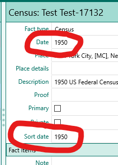

The Sort date is used to sort:

* Facts in the fact list
* People in the people list, when sorted by any Fact or Name date

Currently not used to sort : (but should be!!!!!!!!!)

* By the **tools** "Rearrange children" or "Rearrange spouses".
* By the **buttons** "Rearrange children" or "Rearrange spouses".

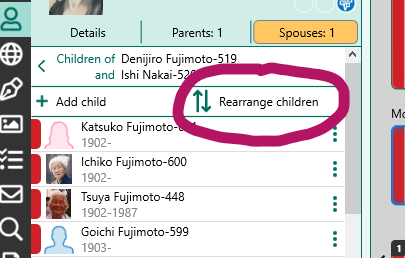
\
\
\
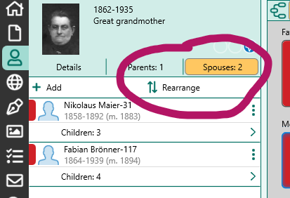

A Sort date is never displayed in reports.\
Sort dates are supported by GEDCOM 7.0, and by many other genealogy apps.\
Only used for sorting items in the RM display and in reports.
The Sort date is, by default, set to the same value as the normal date (except for qualitative date modifiers)\
The Sort date may be edited to any desired value.\
IMHO, no evidence is needed to assign a Sort date when a date is missing.

## Sorting multiple facts on the sane day

Dates in RM are are not TimeStamps and are limited to calendar dates.
No clock time value is allowed.

**When more than one event occurs on the same calendar day and the order of
the events is known, use the dashed sort date feature.**

For a clear explanation, see- [RM v10 help: Date formats](https://help.rootsmagic.com/RM10/date-formats.html),
last section: Sorting events on the same date.

Quick example-
The normal date values for the events may all be the same, but the sort date
for each event would modified by adding -1, -2 -3 etc
For example, if four events happened on May 1, 1950, the sort dates are all
by default, the same as the normal date: 1 May 1950.

Change the sort dates to:\
1 May 1950-1\
1 May 1950-2\
1 May 1950-3\
1 May 1950-4

The corresponding facts will be sorted accordingly.

Note that the character entered by the user is the standard hyphen "-",
but it is changed to an en-dash "–" when displayed.
(Similar to how RM handles date ranges)

For info on dashes and hyphens, see [Em Dash (—) vs. En Dash (–)](https://www.scribbr.com/language-rules/dashes/)

## Advanced Search left-most field values

The Person edit window list several types of items:

* Facts-Personal (also called Events)
* Facts-Family (these are actually linked to family database objects)
* Names (Primary and Alternate Names)
* Shared Facts (also called Witnessed Facts)
* Associations

The Advanced Search feature in RM allows the user to create a query to find
Persons based on most of those items-

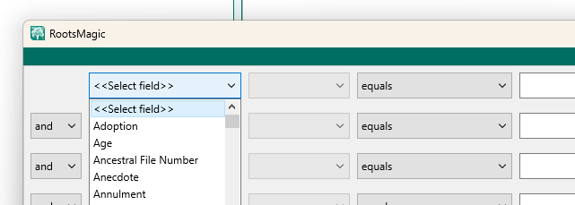

The left most field, at first glance, appears to be a list of all the fact
types used in the database, standard and user created.

However, there are a number of items in the list that aren't Facts.
These include Names, calculated name, calculated numbers, Associations,
and numbers of linked items, person attributes and others.

The items are listed here for reference-

```text
all Facts-Personal
all Facts-Family

Given name(s)
Nickname
Given or Nickname
Surname
Surname (Birth or Marr)
Prefix
Suffix

Any Fact

Note (general)
Note (family)

Record number
Living flag
Sex
FamilySearch ID
Color coding
Date edited
Current age

Number of children
Number of sets of parents
Number of shared facts
Number of siblings
Number of spouses

Source (general)
Source (family)
```

NOTES\

* Names

Given name(s)
Not clear if this looks at multiple alternate names or does special processing
for given name that is a combination of multiple names (middle names).

Calculated items

* Surname (Birth or Marr)\
This is not referring to an Alternate name of type "Married".
This is calculated from a woman's "spouse".
TODO Does it depend on a marriage fact, or just the connection?
Clearly this will generate some false hits for women who do not change their surname.

* Given or Nickname
Probably matches a name record in either the given or nickname field.
This is not referring to an Alternate name of type "Nickname".

* Age
calculated from birth date and current date

* Numbers of linked items
Number of children\
Number of sets of parents\
Number of shared facts\
Number of siblings\
Number of spouses\

Notice that some items can not be searched for:

* Shared Facts
* DNA Note
* Health Note
* FAN Associations\
The Association item in the list is a RM Standard fact, not an association
created in RM versions 9 and later that are stored in the FANTable.
(family, associates, and neighbors)

## Fact types

[A listing of all standard fact types](Fact_Types_Listing.html) defined by RootsMagic.

## Special characters defined in RM

```text
search
"       start of line anchor
_       a single character wildcard
%       0, 1, or multi character wildcard

{  }       in text fields and notes; private information

Template language characters:
-Field substitution-                  [ ]
-Conditional clause                   < >
-Switch characters-               |, !, ?, %, @ and #
-Data Field Option Separator-          :
-Escape character-                     /
   (use to include <, >, /, [  ])

-Formatting characters- <i> & </i>; <b> & </b>;
                        <u> & </u>; <sc> & </sc>;
                    <sup> & </sup> and <sub> & </sub>
```

The three search characters " _ % are valid in:

* Name index search
* Place search
* Source search
* Task search
* Addresses search
* (but NOT valid in Media search or Advanced search)

## Thesaurus

Database items are sometimes referenced by different names in the user interface
in different contexts.
When design changes were made to RM over the years, not all parts of the program
were brought up to date.

Here is a list of items that may be confusing- [Thesaurus](thesaurus/RootsMagic_Thesaurus.html)

## Advanced Search Options Listing

in progress- not done- may not be useful...\
see-  [Advanced Search options](Advanced_Search.html)

## Adding Media Files to RM after Download in Internet Browser

These instructions are for the current version (2023-11) of Chrome on Windows.
Probably similar for MacOS and Edge.

When a file is downloaded in Chrome, after the file save dialog is closed,
a small pop up window appears near the upper right corner of the browser window.

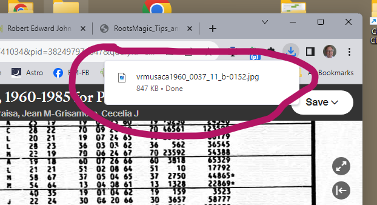

If one has the RM "Media=>Add Media=>Drop New Media" "drag and drop target"
displayed, one can drag the small pop-up window onto the RM drop target to
add the downloaded file to RM media.

This window disappears as soon as any action other than dragging is taken, like
switching windows, clicking in the browser etc. So if the RM drop target is not
already visible on the screen, the window will vanish before you can set it up.

No worries- instead, set up the RM drop target, position the window so it will
be visible when the focus is switched to the browser, and then in the browser,
click the "downloads" button. This will display a list of recent downloaded files.
You can drag the listed file that you want to the RM drop target.

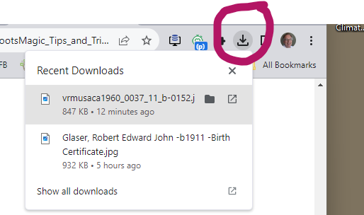

This illustrates the dragging of a file listed in the downloads list to the
RM Drop Media Target area.

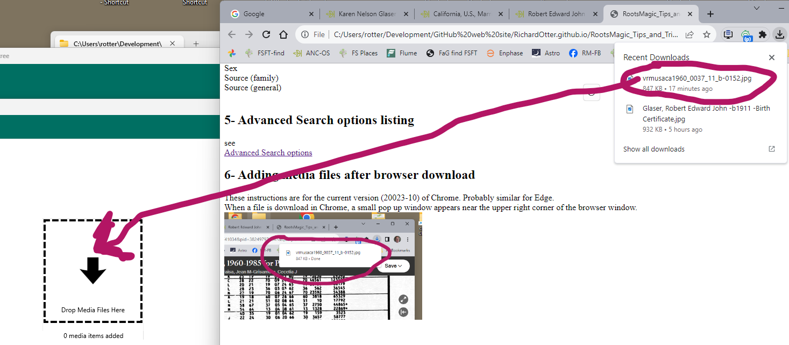

## Opening a second instance of the same database

RM is not designed to do this. In fact it is designed to prevent this.
SQLite has no problem with multiple processes accessing the same file,
Database writes are serialized by using file locking.

There are easy workarounds to RM's prohibition to opening the same file
twice but one will encounter numerous "file locked" error messages.
I have not seen any problems caused by this, but it does not inspire confidence
and the alternate ide below works very well.

A simple and robust alternate method is to take a recent copy of the
database file, rename it to something like "OLD COPY YYYY-MM-DD.rmtree"
and change its properties to Read Only.
(Right click the file in Windows File Manager and select Properties.)

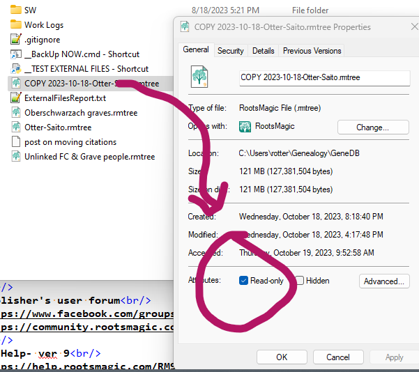

Then when you want to see a part of the database that is inaccessible,
one can open this Read Only "OLD COPY" database in the same instance of RM.
It won't be current, but for most situations, that will be OK.

You won't be able to make accidental changes to the Read Only
database, so your modifications will always go to the correct open file.

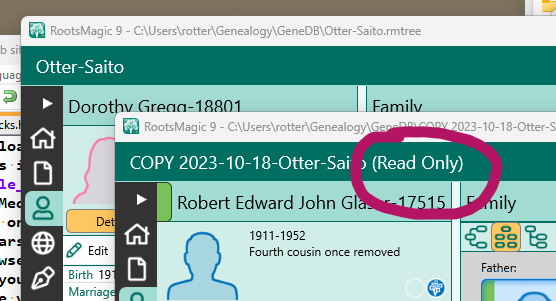

Unfortunately, modal windows, such as the citation entry, for example, will
still prevent you from interacting with the other database's windows.
You'll need a real second instance of RM to overcome that.
But perhaps the COPY database window can be arranged on the screen
to be visible while working in the modal window.

## Online resources for RootsMagic

### From the SW Publisher

Main website\
<https://www.rootsmagic.com>

Publisher's user forum\
<https://www.facebook.com/groups/RootsMagicUsers>
<https://community.rootsmagic.com/>

RM Help- ver 10\
<https://help.rootsmagic.com/RM10/index.html>

RM Help- ver 9\
<https://help.rootsmagic.com/RM9/index.html>

RM Help- ver 8\
<http://wiki.rootsmagic.com/wiki/RootsMagic_8:RootsMagic_8>

### Independent Sites

Users forum\
<https://rootsmagic-users.groups.io>

Premier site for discussion of RootsMagic direct SQL access\
<https://sqlitetoolsforrootsmagic.com/>

Reddit\
<https://www.reddit.com/r/RootsMagic/>

## Confirming that a downloaded software installer is not corrupted

One often sees posts in forums that users, when they are having software
problems, have suspicions that the downloaded installer they are using
is somehow corrupted.

This can easily be ruled out by checking the installer file's digital signature.
If the signature is OK, one can be assured that the file contents are OK, or
at least they have been unchanged since creation by the publisher.
Same method can be used to check the integrity of any signed exe or dll file.

To check an installer's digital signature-

Find the installer exe file in Windows File Manager.

Right click the installer exe file and select Properties from the end of the menu.

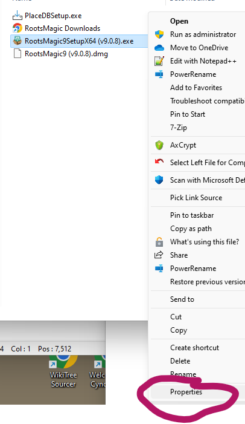

Click on the Digital Signatures tab in the Properties window.

Select the sha256 item in the list and click the Details button.

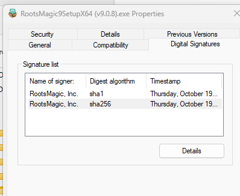

Examine the Digital Signatures Details window and look for "Digital Signature OK".

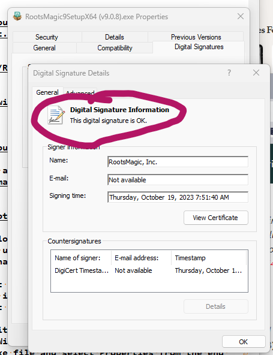

The "Digital Signature OK" means that the installer file on your computer
is exactly the same as the file created by RootsMagic Inc.
Not a single bit has been changed.

## Consider using Git version control to track media files

External file names and locations are tracked by RootsMagic, but the
files' contents are not.

See [Git for Windows](https://git-scm.com/download/win) for the Windows download.

Tip: Use the lfs (large file system) for Git to make backups easier.

Pro's-

* All changes to external file names and locations can be reviewed and confirmed.
* Another back up of your file data.
* Deletion of files or unexpected modification are made apparent.
* It's free and you will learn something if you don't already use Git.

Con's-

* Git is designed to be used with text files. Most media files in RM are binary.
However, it still works great. You can use BeyondComapre as your diff utility
for images.
* Git does not preserve the file system time stamps for files.

## Media Folder and Relative Paths

Media files can be linked from anywhere. The program specified media folder
is a suggested location to centralize all media.
It is also the base directory that opens when one adds new media.

This is based on RM ver >=8's Relative path start points-

```text
?    media folder as set in RM preferences
~    home directory (%USERPROFILE%)
*    folder containing the RM database
```

If the file is not "below" one of those three start points, it's listed in
the database as an absolute path.

These are expanded when found in the first position of the stored path.
All of the path's in my database start with ?, meaning they are all in
the Media folder.
I've never tested the priority, but I suspect it is Media Folder first.
(This guess is based on the fact that all of my media file paths start with ?,
meaning they are in the media folder.)

One nice feature is that if you move the database and media folder to
another computer or drive, one can simply reset the Media folder preference
item to the new folder location and you're done.

## Citation and source fields are text

Citation and source fields come in several types- Names, dates, places.

Dates are handled the same as dates in facts, places and names are not.
Places are not connected to the places in the places tab.
Names are not connected with other names in the DB. They are just text.

The type that is assigned just specifies the type of special functions
that can be applied to them within the sentence/source language.

## Names, Primary and Alternate

The items listed in a person's edit page may be of these different types-

```text
Facts (also called: Events)
Shared Facts
Names
Associations
```

Regarding Names-
The primary name item corresponds to the name at the top of the Edit Person
window's listing.
A person may be assigned more than one name, one of which will be primary.

For Names, the primary one is Listed in the Edit Person window as "Primary Name"
and the others are listed as "Alternate Name".
It's a bit odd in that for other facts, all facts of the same type have the
same fact name in the listing.
For instance, if there are multiple Residence facts, all will be listed as
Residence even if one is made primary.

An Alternate name may be changed to the Primary name using the primary
check box in the alt name's edit panel.

Clicking on the Name at the top of the listing allows one to attach-
Note, Source, Media, Tasks, and address to the PERSON.

Clicking on the Primary Name fact in the body of the listing allows
one to attach- Note, Source, Media and Tasks to the NAME item.

Where one should attach sources- to the Person or to the Name is
I think a philosophical question. I attach to the name that is being documented.

Also note that the Primary Name or Alternate Name fact allows setting
Name type, Proof, Date and Sort date.
Not quite the same as other facts, but close.
Names cannot be shared.
Alternate Name also allows setting of the Primary and Private flags.\
(That the Primary flag is displayed on Alt Names only, I understand.
I'm not clear why primary names can't be made private...)

All of my Alternate Names have sort date (and actual dates when they are know).
They are generally used at a certain time, marriage for instance.

Most of my primary names don't have a date or sort date.
The primary names that do have dates are special cases where I am not
using the person's birth name as primary.
The Alt name of type Birth I set to same date as birthday, the Primary
name of different type (Immigrant name, AKA) is set to the date it is first used.

## Media Tab: Force synchronization of the left and right hand panels

A current bug which I find very annoying appears in the Media Tab.
There are time when the information in the left hand and right hand
panels is not referring to the same media item.

When this happens, one can force a refresh of the right hand panel
so that it shows the information corresponding to what is shown on the left side.

Procedure:
Use the mouse to "Right-Click" the media item on the left hand side panel.
The "context menu" is displayed. Do not select an item from this menu
Instead, click elsewhere to dismiss the menu.
The right hand side is refreshed and now show the info corresponding
to the left hand side panel.

Note: One must use the mouse to display the context menu.
The context menu key on the keyboard does not work in RM.

## Source Template modification

Changes to a source template that is already in use by sources and citations

### Safe changes

* change source template name
* change field type
* change display name of a field
* change brief hint for a field
* change long hint for a field
* change footnote template
* change short footnote template
* change bibliography template
* change order of source fields
* group source fields to top of list in SourceTemplate edit window

May be made at anytime. No negative consequence.
The changes will be immediately seen in all new and existing source and citations.\
Converting a field type from say, "name" type to "date" would not make
much sense if the field's existing data actually has name data in it.
But it can be done at any time.

### Minor issue

* change order of citation fields

May be made at any time, but existing citations whose citation names were
automatically generated will not be updated with what would be the new
auto generated name using the new order of citation fields.
If this is objectionable, one could open each citation, delete the
existing citation name and let it be auto generated using the new
citation field order.

### Unexpected result

* change state of check-box ("This is a source detail field") for a field with data

This change implies movement of data from a source to a citation
or vice versa. This could be called "Lumping" or "Splitting" source info.\
The existing data will be hidden, but not deleted. A new field will be
created (either source oof citation, depending on the checkbox new status)
but it will not show existing data and will not behave properly with a
footnote template.

### Unexpected result

* change field name
* delete fields
* add new fields

Use my utility: "ChangeSourceTemplate" to update existing source and
citations to the new template structure.

If the utility is not used and these changes are made:

* change field name\
Data is be invisible when accessed with the new name. The old date remains, but
is hidden.
* add new fields\
New fields will not be correctly initialized, sentence language will
not see the new field as empty when tested by `< >` in the sentence language.
* delete fields\
Old data not removed, but is only hidden.
This is not really a problem, but it's not tidy.

## What's Next ?  ...
